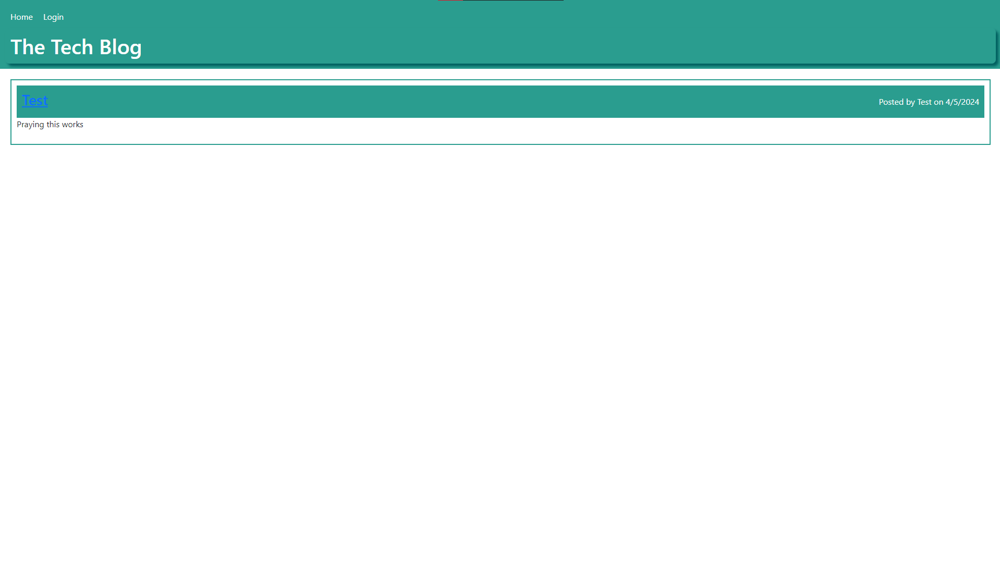

# Post your own Tech thoughts!

Our assignment for Week 14 is to create a blog spot for tech enthusiasts to post their thoughts.

## Table of Contents

- [Usage](#usage)
- [Credits](#credits)
- [License](https://choosealicense.com/licenses/mit/)
- [Questions](#questions)
## Usage
- Use the heroku link below!
    - [CLICK HERE](https://techblogthoughts-5023046c8d69.herokuapp.com/)

Sign in with an already established account, or sign up! Create, edit and delete posts. Its the perfect community spot :)

## Screenshots

## Credits

UofM-VIRT-FSF-PT-10-2023-U-LOLC-ENTG
## License

[MIT](https://choosealicense.com/licenses/mit/)

## Questions

For questions about this project, please contact [CallBeyond](https://github.com/CallBeyond) at d.robles1297@Yahoo.com.